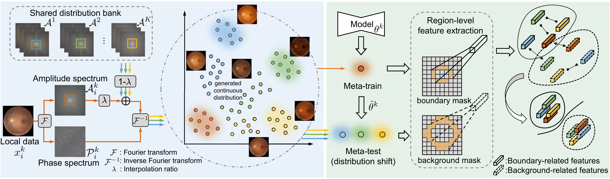
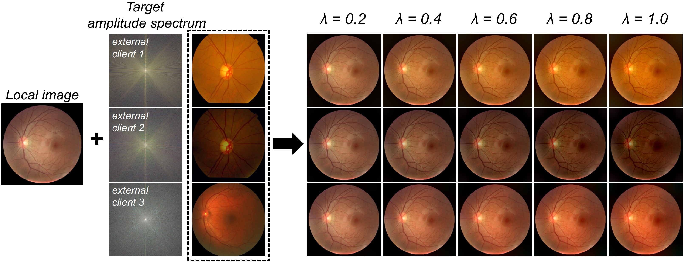

# FedDG: Federated Domain Generalization on Medical Image Segmentation via Episodic Learning in Continuous Frequency Space
by [Quande Liu](https://github.com/liuquande), [Cheng Chen](https://cchen-cc.github.io/), [Jing Qin](https://sn.polyu.edu.hk/en/people/academic_staff/index.html#harry.qin), [Qi Dou](http://www.cse.cuhk.edu.hk/~qdou/), [Pheng-Ann Heng](http://www.cse.cuhk.edu.hk/~pheng/). 

### Introduction

This repository is for our CVPR 2021 paper '[FedDG: Federated Domain Generalization on Medical Image Segmentation via Episodic Learning in Continuous Frequency Space](https://arxiv.org/pdf/2103.06030.pdf)'. 



### Usage

1. Start with a demo for continuous frequency space interpolation among federated clicnets:
   ```shell
   python freq_space_interpolation_demo.py
   ```
<center></center>

2. prepare the dataset from clients, and (1) save the data to 'npy' format and (2) extract the amplitude spectrum of each client's dataset
   ```shell
   python dataset/prepare_dataset.py
   ```
3. organize the dataset as:
   ``` 
     ├── dataset
        ├── client1
           ├── npy
           ├── freq_amp
        ├── clientxxx
        ├── clientxxx
   ```
4. Train the federated learning model with ELCFS:
   ```shell
   python train_ELCFS.py
   ```
   
### Citation
If this repository is useful for your research, please consider citing:
```
@article{liu2021feddg,
  title={FedDG: Federated Domain Generalization on Medical Image Segmentation via Episodic Learning in Continuous Frequency Space},
  author={Liu, Quande and Chen, Cheng and Qin, Jing and Dou, Qi and Heng, Pheng-Ann},
  journal={arXiv preprint arXiv:2103.06030},
  year={2021}
}
```
